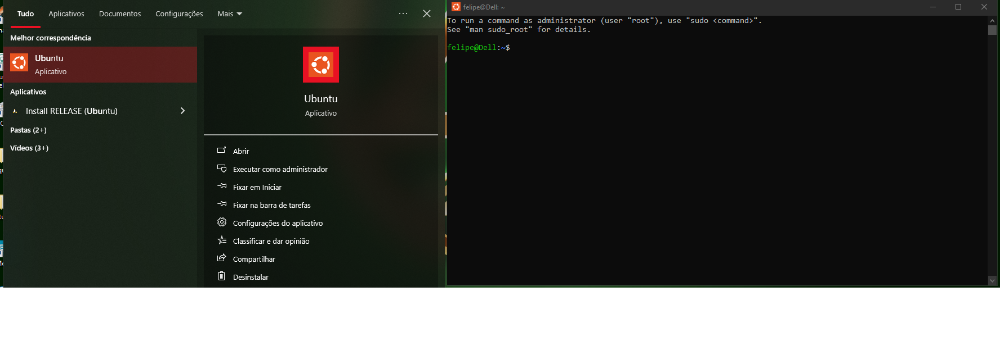
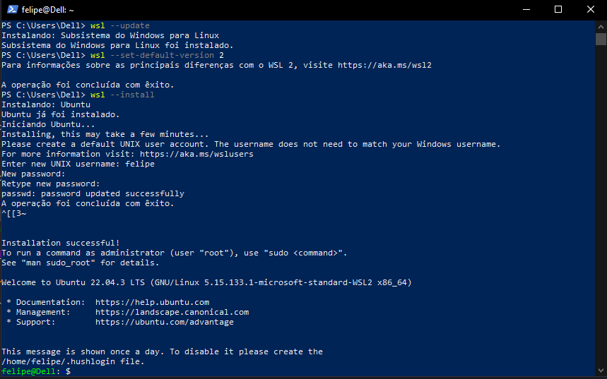
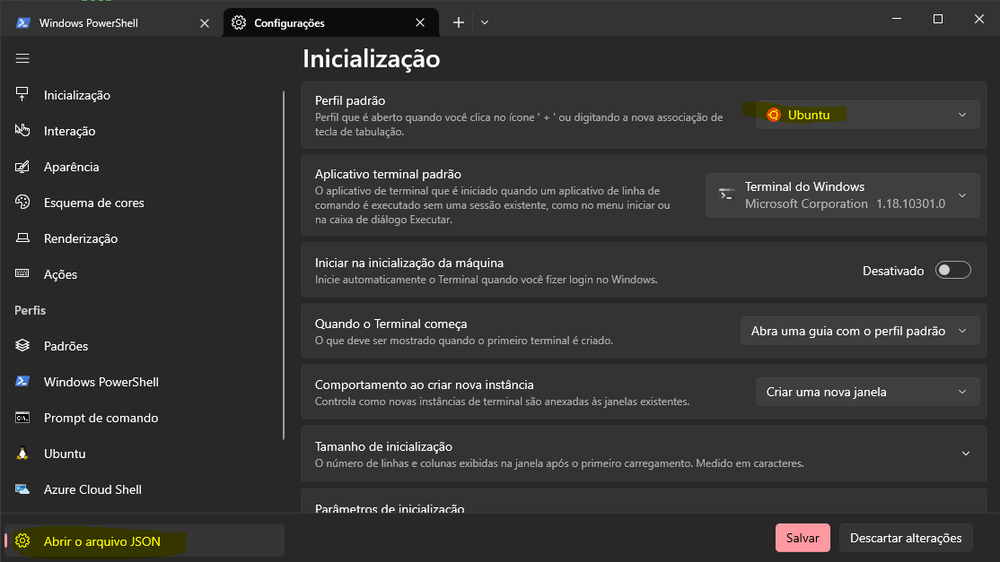
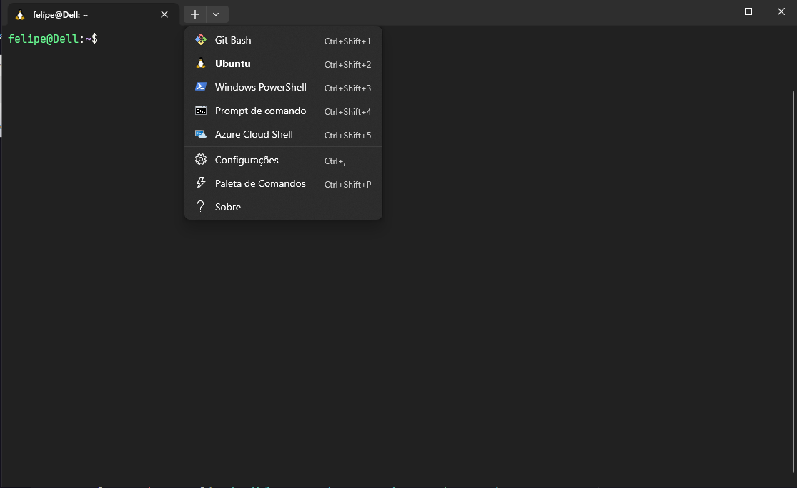
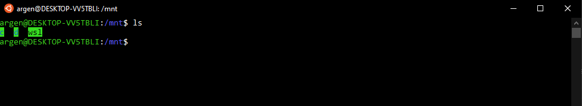
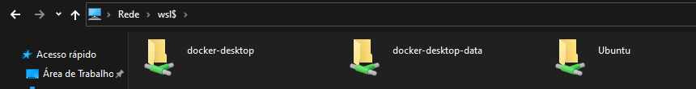
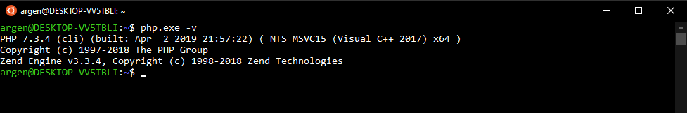
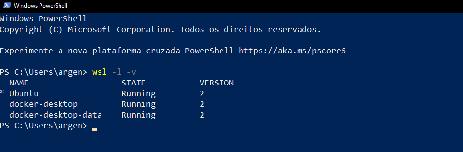

# 🔥 Guia 1 - Produtividades no Windows com (WSL2) + Docker.

## O que é o WSL2 ?

O Windows Subsystem for Linux 2 (WSL2) é uma ferramenta desenvolvida pela Microsoft que permite aos usuários do Windows executar aplicativos e comandos Linux em um ambiente nativo do Windows. 

Com o WSL2, os desenvolvedores podem ter uma experiência de desenvolvimento mais fluida e eficiente, combinando as vantagens dos sistemas operacionais Windows e Linux.

## Instalação do WSL 2 - Windows 10/11

### Windows Update
Verifique se seu Windows está atualizado, pois o WSL 2 depende de uma versão atualizada do Hyper-V. Verifique o Windows Update.

### Instalar / Atualizar o WSL
Com a versão 2004 do Windows 10 ou Windows 11, o WSL já está presente em sua máquina, execute o powershell e digite o comando para pegar a versão mais recente do WSL:

``` bash
wsl --update
```

### Atribuir a versão default do WSL para a versão 2

A versão 1 do WSL pode ser a padrão em sua máquina, execute o comando abaixo para definir como padrão a versão 2:

``` bash
wsl --set-default-version 2
```

### Instale o Ubuntu

Execute o comando:

```bash
wsl --install
```

Este comando irá instalar o `Ubuntu` como o Linux padrão. 

Se você quiser instalar uma versão diferente do Ubuntu, execute o comando `wsl -l -o`. Será listado todas as versões de Linux disponíveis. Instale a versão escolhida com o comando `wsl --install -d nome-da-distribuicao`.

Sugerimos o Ubuntu (sem versão) por ser uma distribuição popular e que já vem com várias ferramentas úteis para desenvolvimento instaladas por padrão.

Após o término do comando, você deverá criar um **nome de usuário** que poderá ser o mesmo da sua máquina e uma **senha**, este será o usuário **root da sua instância WSL**.

Para abrir uma nova janela do Ubuntu, basta digitar `Ubuntu` no menu iniciar e clicar no ícone do Ubuntu.	




### (Opcional) Alterar a versão de uma distribuição do Linux de WSL 1 para WSL 2

Se a distribuição Linux que você instalou estiver na versão 1, você pode alterar para a versão 2 com o seguinte comando:

``` bash
wsl --set-version <distribution name> 2
```

Parabéns, seu WSL2 já está funcionando:




## Instalando o Windows Terminal e o GIT

 Na microsoft store, procure por Windows Terminal e instale!

[Link do Windows Terminal](https://apps.microsoft.com/detail/9N0DX20HK701?hl=pt-br&gl=BR)

 Instale tambem o GIT

[Link do GIT](https://git-scm.com/download/win)

# 🔗 Realize também a instalação das fontes abaixo, são fontes selecionadas pensando em melhor produtividade e visão de codigo.

### Fontes e Temas
- [Fira Code](https://github.com/tonsky/FiraCode)
- [JetBrains Mono](https://www.jetbrains.com/lp/mono/)
- [dracula-pro-themes](https://1drv.ms/u/s!AuXLpUXd3wwLh30BhC2OZNQbuogX?e=gVW0ac)

Após instalar, abra o Windows terminal e vá em configurações, altere o perfil padrão para ubuntu e abra o arquivo JSON




Dentro da pasta dotfiles, disponibilizei um arquivo txt com as configurações para substituir no arquivo json do Windows Terminal,
copie e cole dentro do arquivo e salve.

basicamente dentro desse arquivo, eu defini que a fonte que vamos utilizar no terminal é a Jetbrains Mono, e os caminhos para 
mapear o ubuntu, powershell, CMD e GIT BASH, alem das cores que irá utilizar o tema Dracula.

[Settings Terminal](dotfiles/Settings.json%20(windows%20terminal).txt)

Copie as informações todas do arquivo acima, e substitua no arquivo do terminal, após abrir será exibido como na imagem abaixo, com
todas as ferramentas em um unico terminal como pode ser visto na imagem abaixo.



## O que o WSL 2 pode usar de recursos da sua máquina

Podemos dizer que o WSL 2 tem acesso quase que total ao recursos de sua máquina. Ele tem acesso por padrão:

* A todo disco rígido.
* A usar completamente os recursos de processamento.
* A usar 80% da memória RAM disponível.
* A usar 25% da memória disponível para SWAP.

Isto pode não ser interessante, uma vez que o WSL 2 pode usar praticamente todos os recursos de sua máquina, mas podemos configurar limites.

Crie um arquivo chamado `.wslconfig` na raiz da sua pasta de usuário `(C:\Users\<seu_usuario>)` e defina estas configurações:

```txt
[wsl2]
memory=3GB
processors=2
swap=1GB
```

Estes são limites de exemplo e as configurações mais básicas a serem utilizadas, configure-os às suas disponibilidades.
Para mais detalhes veja esta documentação da Microsoft: [https://learn.microsoft.com/pt-br/windows/wsl/wsl-config#configuration-setting-for-wslconfig](https://learn.microsoft.com/pt-br/windows/wsl/wsl-config#configuration-setting-for-wslconfig).

Para aplicar estas configurações é necessário reiniciar as distribuições Linux. Execute o comando: `wsl --shutdown` no PowerShell (Este comando vai desligar todas as instâncias WSL 2 ativas, basta abrir o Windows terminal novamente para usa-las já com as novas configurações).


> NESSA ETAPA JA TEMOS O WINDOWS TERMINAL CONFIGURADO COM O WLS 2 UTILIZANDO O UBUNTU, OQUE JA OTIMIZA MUITO NOSSA PRODUTIVIDADE NO TERMINAL
> INICIAREMOS AGORA A INSTAÇÃO DO DOCKER ENGINE

### Porque usar WSL 2 + Docker para desenvolvimento

Configurar ambientes de desenvolvimento no Windows sempre foi burocrático e complexo, além do desempenho de algumas ferramentas não serem totalmente satisfatórias.

Com o nascimento do Docker este cenário melhorou bastante, pois podemos montar nosso ambiente de desenvolvimento baseado em Unix, de forma independente e rápida, e ainda unificada com outros sistemas operacionais.

### Docker Engine (Docker Nativo).

* [Docker Engine (Docker Nativo) diretamente instalado no WSL2](#docker-engine-docker-nativo-diretamente-instalado-no-wsl2).

> NESSE TUTORIAL IREI ABORDAR APENAS A INSTALAÇÃO DO DOCKER ENGINE POIS COM ELE, TEREMOS UMA MELHOR COMPATIBILIDADE NO UBUNTU.

O Docker Engine é o Docker nativo que roda no ambiente Linux e completamente suportado para WSL 2. Sua instalação é idêntica a descrita para as próprias distribuições Linux disponibilizadas no site do [Docker](https://docs.docker.com/engine/install/ubuntu/).

Instale os pré-requisitos:

```
sudo apt update && sudo apt upgrade
sudo apt remove docker docker-engine docker.io containerd runc
sudo apt-get install \
    apt-transport-https \
    ca-certificates \
    curl \
    gnupg \
    lsb-release
```

Adicione o repositório do Docker na lista de sources do Ubuntu:

```
curl -fsSL https://download.docker.com/linux/ubuntu/gpg | sudo gpg --dearmor -o /usr/share/keyrings/docker-archive-keyring.gpg
echo \
  "deb [arch=amd64 signed-by=/usr/share/keyrings/docker-archive-keyring.gpg] https://download.docker.com/linux/ubuntu \
  $(lsb_release -cs) stable" | sudo tee /etc/apt/sources.list.d/docker.list > /dev/null
```

> OBSERVAÇÃO: Se você estiver usando uma distribuição diferente do Ubuntu, substitua os endereços acima respectivamente:
> Exemplo: Instalando o docker-engine no Debian:
> ```
> curl -fsSL https://download.docker.com/linux/debian/gpg | sudo gpg --dearmor -o /usr/share/keyrings/docker-archive-keyring.gpg
> echo \
> "deb [arch=amd64 signed-by=/usr/share/keyrings/docker-archive-keyring.gpg] https://download.docker.com/linux/debian \
> $(lsb_release -cs) stable" | sudo tee /etc/apt/sources.list.d/docker.list > /dev/null
> ```

Instale o Docker Engine no ubuntu, inicie o Windows terminal com ubuntu e siga os comandos abaixo:

```
sudo apt-get update
```

```
curl -fsSL https://download.docker.com/linux/ubuntu/gpg | sudo gpg --dearmor -o /etc/apt/trusted.gpg.d/docker-archive-keyring.gpg
```

```
sudo add-apt-repository "deb [arch=amd64] https://download.docker.com/linux/ubuntu $(lsb_release -cs) stable"
```

```
sudo apt-get install docker-ce docker-ce-cli containerd.io docker-buildx-plugin docker-compose-plugin
```

Dê permissão para rodar o Docker com seu usuário corrente:

```
sudo usermod -aG docker $USER
```


Reiniciar o WSL via linha de comando no Windows PowerShell para que não seja necessário autorização root para rodar o comando docker:

```
wsl --shutdown
```

Acessar novamente o Ubuntu e iniciar o serviço do Docker:

```
sudo service docker start
```

Este comando acima terá que ser executado toda vez que o Linux for reiniciado. Se caso o serviço do Docker não estiver executando, mostrará esta mensagem de erro ao rodar comando `docker`:

```
Cannot connect to the Docker daemon at unix:///var/run/docker.sock. Is the docker daemon running?

```

O Docker Compose instalado agora estará na versão 2, para executa-lo em vez de `docker-compose` use `docker compose`.


### Erro ao iniciar o Docker no Ubuntu 22.04

> Se mesmo ao iniciar o serviço do Docker acontecer o seguinte erro ou similar:
>
> `Cannot connect to the Docker daemon at unix:///var/run/docker.sock. Is the docker daemon running?`
> Rode o comando `sudo update-alternatives --config iptables` e escolha a opção 1 `iptables-legacy`
>
> Rode novamente o `sudo service docker start`. Rode algum comando Docker como `docker ps` para verificar se está funcionando corretamente. Se não mostrar o erro acima, está ok.

### Systemd - Inicia o serviço do docker automaticamente (RECOMENDADO)

O WSL é compatível com o `systemd`. O `systemd` é um sistema de inicialização e gerenciamento de serviços que é amplamente utilizado em distribuições Linux modernas. Ela permitirá que você use ferramentas mais complexas no Linux como snapd, LXD, etc.

Não é obrigatório ativa-lo e a qualquer momento ele pode ser desativado e reativado. Para ativa-lo, edite o arquivo `/etc/wsl.conf`:

Rode o comando para editar:

```conf
sudo vim /etc/wsl.conf
```

Aperte a letra `i` (para entrar no modo de inserção de conteúdo) e cole o conteúdo:

```conf
[boot]
systemd = true
```

Quando terminar a edição, pressione `Esc`, em seguida tecle `:` para entrar com o comando `wq` (salvar e sair) e pressione `enter`.

Toda vez que esta mudança for realizada é necessário reiniciar o WSL com o comando `wsl --shutdown` no DOS ou PowerShell.

### Docker com Systemd

Quando ativamos o systemd, na maioria dos casos o Docker iniciará automaticamente, portanto se você se tem a linha `command = service docker start` no `/etc/wsl.conf`, comente-a com `#` e reinicie o WSL com o comando `wsl --shutdown`.

Caso contrário, você pode inicia-lo automaticamente usando os comandos:

```bash
sudo systemctl enable docker.service
sudo systemctl enable containerd.service
```

É necessário reiniciar o WSL com o comando `wsl --shutdown` para que as mudanças tenham efeito.


Pronto, basta reiniciar o WSL com o comando `wsl --shutdown` no DOS ou PowerShell para testar. Após abrir o WSL novamente, digite o comando `docker ps` para avaliar se o comando não retorna a mensagem acima: `Cannot connect to the Docker daemon at unix:///var/run/docker.sock. Is the docker daemon running?`


### Dicas e truques básicos com WSL 2

* A performance do WSL 2 está em se executar tudo dentro do Linux, por isso evite executar seus projetos com ou sem Docker do caminho `/mnt/c`, pois você perderá performance.
* Para abrir o terminal do WSL basta digitar o nome da distribuição no menu Iniciar ou executar `C:\Windows\System32\wsl.exe`.
* O sistema de arquivos do Windows 10/11 é acessível em `/mnt/c`.

* É possível acessar o sistema de arquivos do Linux pela rede do Windows, digite `\\wsl$` no Windows Explorer.

* É possível acessar uma pasta no Windows Explorer digitando o comando ```explorer.exe .```.
* É possível abrir uma pasta ou arquivo com o Visual Studio Code digitando o comando ```code . ou code meu_arquivo.ext```.
* Incrivelmente é possível acessar executáveis do Windows no terminal do Linux executando-os com .exe no final (não significa que funcionarão corretamente).

* É possível executar algumas aplicações gráficas do Linux com WSL 2. Leia este tutorial: [https://medium.com/@dianaarnos/aplica%C3%A7%C3%B5es-gr%C3%A1ficas-no-wsl2-e0a481e9768c](https://medium.com/@dianaarnos/aplica%C3%A7%C3%B5es-gr%C3%A1ficas-no-wsl2-e0a481e9768c).
* Execute o comando ```wsl -l -v``` com o PowerShell para ver as versões de Linux instaladas e seu status atual(parado ou rodando).

* Execute o comando ```wsl --shutdown``` com o PowerShell para desligar todas as distribuições Linux que estão rodando no momento (ao executar o comando, as distribuições do Docker também serão desligadas e o Docker Desktop mostrará uma notificação ao lado do relógio perguntando se você quer iniciar as distribuições dele novamente, se você não aceitar terá que iniciar o Docker novamente com o ícone perto do relógio do Windows).
* Execute com o PowerShell o comando ```wsl --t <distribution name>``` para desligar somente uma distribuição Linux específica.
* Se verificar que o WSL 2 está consumindo muitos recursos da máquina, execute os seguintes comandos dentro do terminal WSL 2 para liberar memória RAM:
```bash
echo 1 | sudo tee /proc/sys/vm/drop_caches
```
* Acrescente `export DOCKER_BUILDKIT=1` no final do arquivo .profile do seu usuário do Linux para ganhar mais performance ao realizar builds com Docker. Execute o comando `source ~/.profile` para carregar esta variável de ambiente no ambiente do seu WSL 2.
* No Windows 11 é possível iniciar o Docker automaticamente, veja a seção: [Dica para Windows 11](#dica-para-windows-11)

## Dúvidas

* O WSL 2 funciona junto com outras máquinas virtuais como **VirtualBox** ou **VMWare**? Siga a [referência](https://learn.microsoft.com/pt-br/windows/wsl/faq#poderei-executar-o-wsl-2-e-outras-ferramentas-de-virtualiza--o-de-terceiros--como-vmware-ou-virtualbox-)

## Quer dicas como ser mais produtivo no Windows?

Acesse os tutorias abaixo:

- Configuração de ambiente de desenvolvimento produtivo: [https://github.com/fegoncalvesac/ambiente-dev-produtivo](https://github.com/argentinaluiz/ambiente-dev-produtivo)
- Como montar um ambiente produtivo no VSCode: [https://github.com/argentinaluiz/my-vscode-settings](https://github.com/argentinaluiz/my-vscode-settings)
